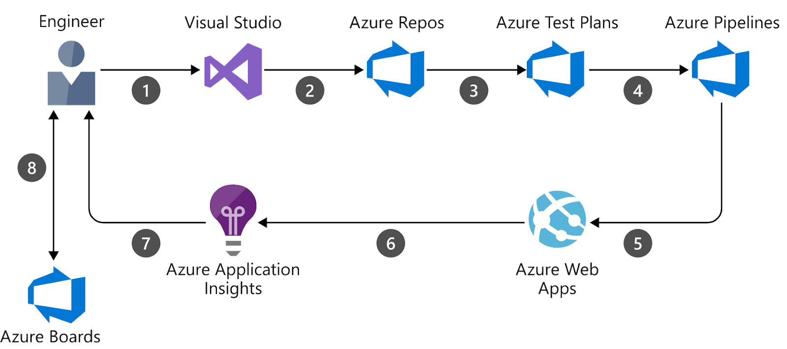

# Simple Azure DevOps CI/CD for a Containerized Flask App

This project demonstrates a simplified end-to-end DevOps pipeline on Azure using a containerized Flask web application. It simulates a real-world deployment workflow without incurring active cloud costs.

---

## 🧠 Objectives

- Showcase Azure DevOps CI/CD pipelines
- Use Infrastructure-as-Code (IaC) to provision resources
- Containerize and deploy a web application to Azure Web App for Containers
- Present infrastructure clearly with a cloud architecture diagram

---

## ⚙️ Tools & Technologies

- Azure Web App for Containers
- Azure Container Registry (ACR)
- Azure DevOps Pipelines (YAML-based)
- Docker
- Flask (Python)
- Bicep (or Terraform)
- GitHub

---

## 📦 Project Components

### Application
A minimal Flask app located in the `app/` folder. It’s packaged in a Docker container.

### Infrastructure as Code (IaC)
Bicep or Terraform template provisions the following:
- Azure Web App (Linux)
- Azure Container Registry
- App Service Plan

### CI/CD Pipeline
Azure DevOps pipeline handles:
1. Docker image build and push to ACR
2. Deployment to Azure Web App
3. Optional post-deployment health checks

---

## 📊 Architecture Diagram



---

## 📷 Portfolio Screenshot

A screenshot of the running Flask application (localhost or mockup) is included to demonstrate UI output for portfolio use.

---
🏁 Future Improvements
Add integration with Azure Monitor

Configure staging slot deployment

Add unit test pipeline stage

## 🚀 How to Use

> ⚠️ This project is **not meant to be deployed** to avoid cloud costs.

However, to run locally:
```bash
cd app/
docker build -t flask-demo .
docker run -p 5000:5000 flask-demo


